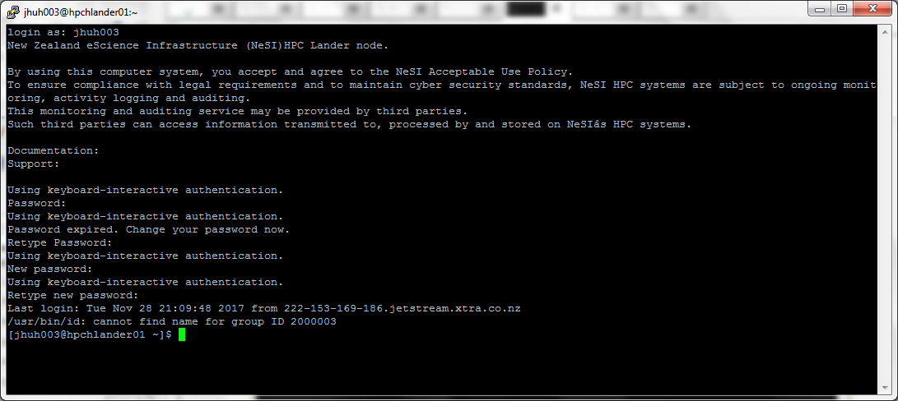
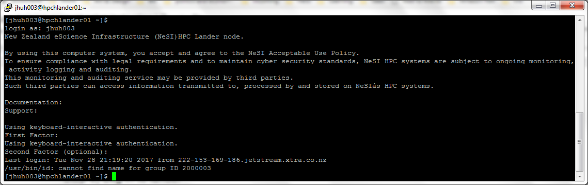

You will learn how to set up your account on Kupe and how to log in onto the machine.

### Setting up account on Kupe

If you are logging in for the first time to Kupe, you will need to set up your account. First, you will need to log in to NeSI user portal. This populates NeSI database with your basic account information which will be used to set up your account.

1. Access [My NeSI  Portal](https://my.nesi.org.nz) via your browser.
 
2. Log in using your institutional credentials via Tuakiri. See example below for logging in with NIWA credentals.


3. After successful login, you should see a screen similar to the one below


4. Please click on ‘Reset Password’ button to proceed. It will send you an e-mail with temporary URL.


**Note** If you don’t see ‘Reset Password’ button and instead see error messages, it means your information on our database did not match your Tuakiri identity. Please see the bottom of the page for troubleshooting section and contact Aaron and Jun at aaron.hicks@nesi.org.nz and jun.huh@nesi.org.nz, and provide us with your name and e-mail address and we will fix your account.

5. Clicking on the link on your e-mail will open up the following page that shows your temp password.


Connecting to the HPC requires two-factor authentication at all times, your password, and an additional factor. These additional factors can be:
- A keycode provided by an external generator (e.g., via smartphone app)
- Connecting from NIWA's physical network (at a NIWA branch)
- Connecting through a NIWA VPN session

### Logging in to Kupe

You will need a terminal program to log into Kupe:

- Windows: MobaXterm, Windows 10 bash, Putty
- MacOS X: Terminal app, iTerm2
- Linux: Terminal app

Using a terminal program and SSH into lander.nesi.org.nz using the Kupe linux username displayed on the portal and the temporary password above. (Any Kupe node can be used with ssh for the password reset, but only the lander node is accessible to external users.)

When you log in using your temporary password, the lander node will ask you to change your password immediately. Please follow the instruction on the shell.

Important: Continue from here only if you are outside NIWA. If you are connecting from inside the NIWA network or have NIWA VPN, your account is all ready to go. You can connect directly to the login node at login.kupe.niwa.co.nz.

#### Logging in from outside of NIWA computer network

Note: You can skip this section if you log on from inside the NIWA network.

Go back to My NeSI portal and click on Accounts or refresh the page and you will see a new option to ‘Link your mobile device’


Clicking on link your mobile device will prepare your 2nd factor login so that you can log in to our lander node from outside of the NIWA network.

After clicking on ‘Link your mobile device’ you will be instructed to prepare your mobile device before proceeding.


Please make sure you have a mobile device with a working camera and then install Google Authenticator app (free). The next step can only be done once.

Click ‘Continue’ and scan your QR code


Open your Google Authenticator app and click on the add button and select ‘Scan a barcode’. Point your camera at the QR code displayed on the screen and it will be added to your phone.

Log in to lander


Now logging in to the lander node will prompt you for ‘First factor’ where you enter your newly set password, and ‘Second factor’ which is the 6 digit code displayed on your Google Authenticator app. The 6 digit code rotates every 30 seconds, and it can only be used once. This means that you can only log in to the lander node once every 30 seconds. Also the prompt says (optional), but it is not optional, and we are working to fix the message.

Once you have landed on the lander node, type the following command to log in to the login node.

```
   ​ssh -X login.kupe.niwa.co.nz
```

The login node will ask you for a password. If you have your 2nd factor set, you must type your password followed immediately by the 2nd factor token. E.g. mypassword345678 where 345678 is your 6-digit code from the mobile. Our platforms team is working on a fix, because the login node should not require your 2nd factor token.


#### Shells

Your login shell is ```bash```. Other shells (```ksh```, ```tcsh``` and ```csh```) are also installed and can be invoked.

#### Troubleshooting
After you logged into the MyNeSI Portal, you may see one of the following screens. Please contact Aaron and Jun at aaron.hicks@nesi.org.nz and jun.huh@nesi.org.nz, and provide us with your name and e-mail address and we will fix your account. Also, let us know which of the following screen you see, and we will be able to address your issue quicker. Thank you.

If your account is not ready, you may see:


If your project is not set up, you may see:


**Please do not create or modify any files or directories in your home directory or in any of the directories that were migrated from FitzRoy - synchronisation between FitzRoy and Kupe is still ongoing, and modified files on Kupe will be overwritten!**

#### Copying files via the login node

The lander node filestem is distinct from the Kupe filesystem, and so copying a file from your desktop to Kupe is by default a two-step process.  This inconvenience can be avoided by setting up an SSH config file such as:
```
Host kupe01
   User your_username
   Hostname kupe01
   ProxyCommand ssh -W %h:%p lander.nesi.org.nz
```
With that configured, `ssh kupe01` should take you there directly, jumping across the lander node on the way.

There is also the problem of having to use both authentication factors every time you use `scp`.  The following method allows passwordless `scp` while you have an `ssh` session open, but it does bring some complications and so is not reccomended unless you often use `scp`.  First create the directory `~/.ssh/sockets` on your machine, and then set up your `~/.ssh/config` with:
```
ControlPath ~/.ssh/sockets/%r@%h:%p
Host kupe01
   User your_username
   Hostname kupe01
   ProxyCommand ssh -W %h:%p lander.nesi.org.nz
   ControlMaster auto
   ControlPersist 1
```

For full details see https://en.wikibooks.org/wiki/OpenSSH/Cookbook/Multiplexing
