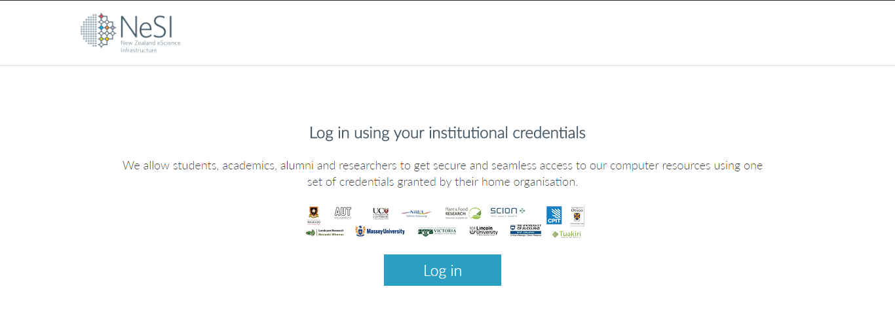
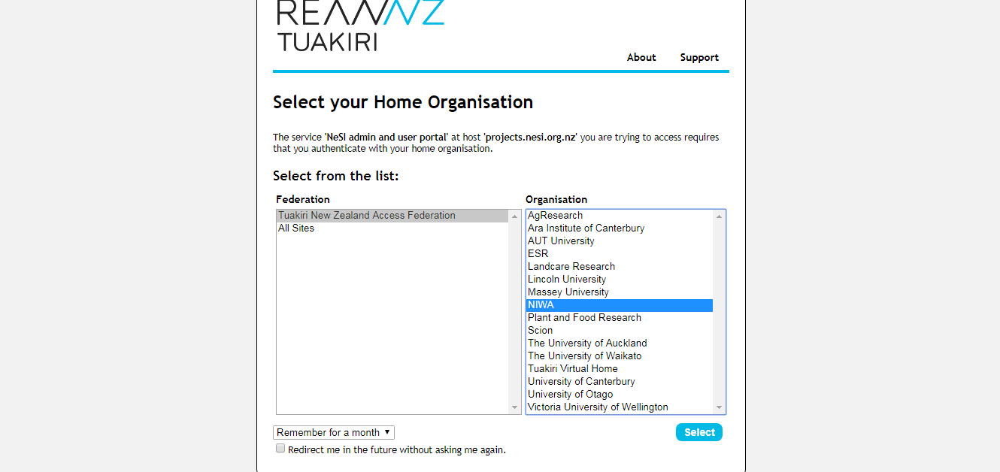
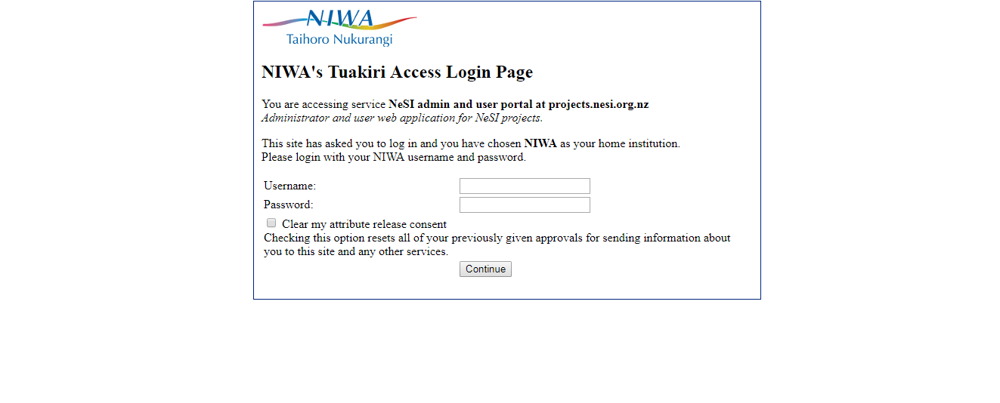
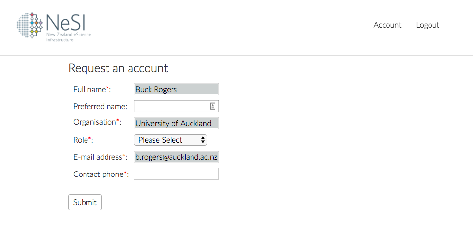
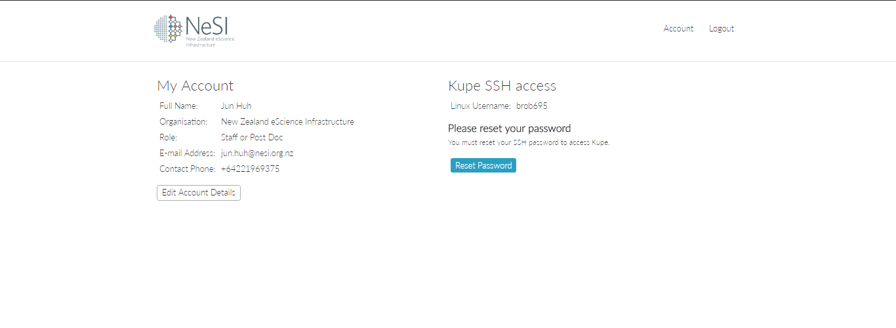
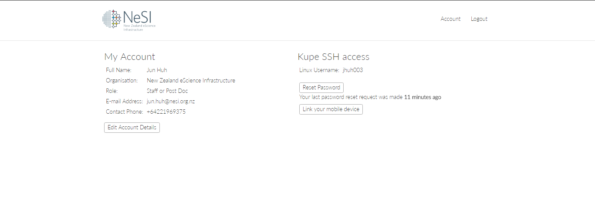
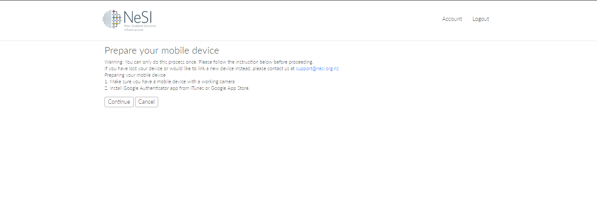
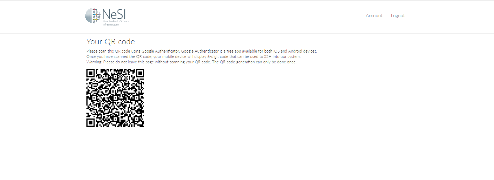
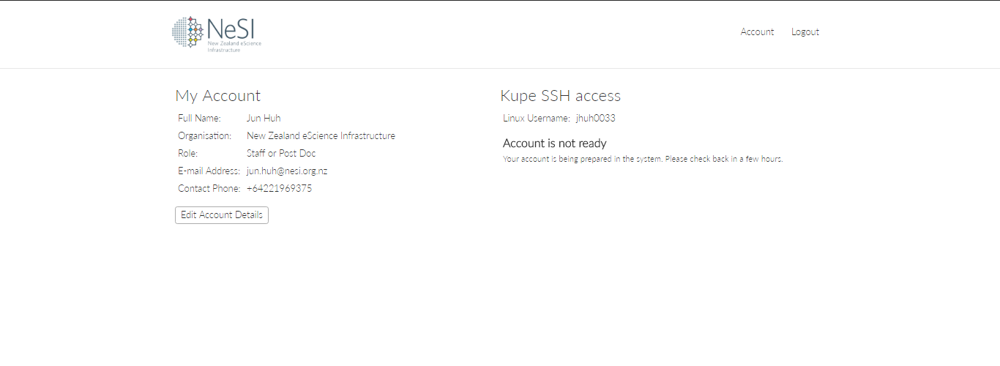
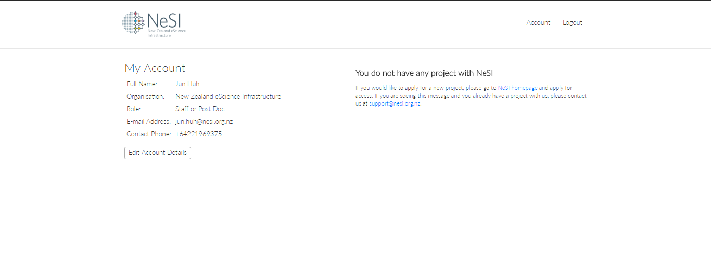

## Outline

You will learn how to:

 1. set up your account on kupe
 2. set up two factor authentication (if you will need to connect from outside NIWA's network)
 3. log in to the machine

## Requirements

You will need a terminal program to log in to Kupe:

- Windows: [MobaXterm](https://mobaxterm.mobatek.net/), Windows 10 bash, or [PuTTY](https://www.putty.org/)
- MacOS X: Terminal app, iTerm2
- Linux: Terminal app, xterm
- A smartphone with the Google Authenticator app or another compatible authenticator app installed

---

## Setting up an account on Kupe

If you are logging in for the first time to Kupe, you will need to set up your account. First, you will need to log in to [the My NeSI portal](https://my.nesi.org.nz). By logging in, you will populate the NeSI database with certain basic account information (such as your name, institution and email address), which we will use to set up your account.

1. Access the [My NeSI Portal](https://my.nesi.org.nz) via your browser.
   

2. Log in using your institutional credentials via Tuakiri. If your institution is not a member of the Tuakiri federation, you will have to follow the 'Apply for a NeSI Account' link below th 'Log in' button to request a Tuakiri Virtual Home account. Once we have approved and created your Tuakiri Virtual Home account, please select the Tuakiri Virtual Home as your Home Organisation. See the example below, which shows the login process using a NIWA staff username and password. Otherwise, when logging in, please select your own home organisation.
   
   

3. If this is the first time you have logged in to the [My NeSI Portal](https://my.nesi.org.nz) and you do not have an existing account with NeSI on Pan you will be prompted to request an account, after filling out some required fields. After submitting your request you must wait for our support team to contact you via email before continuing. If you have a Pan account, after logging in you will need to email [support@nesi.org.nz](mailto:support@nesi.org.nz?subject=Please%20confirm%20my%20My%20NeSI%20account%20and%20add%20me%20to%20a%20project%20team) and inform us that you are attempting to gain access to Kupe so that we can manually ensure that you have proper group membership needed to gain access.

   
   
4. After receiving confirmation from our support team to continue,log in to the [My NeSI Portal](https://my.nesi.org.nz) again. Once you have logged in, you should see a screen similar to the one below. Click on the 'Reset Password' button to proceed.
wait for us to confirm your account and add you to an appropriate project group. This is currently a manual step that we aim to complete for every user within two business days of receiving the request.

   If you don't see the 'Reset Password' button and instead see error messages, it means your information on our database does not match your Tuakiri identity, your user account has not yet been created, or you are not a member of an active project. In this case, please email [support@nesi.org.nz](mailto:support@nesi.org.nz?subject=Please%20confirm%20my%20My%20NeSI%20account%20and%20add%20me%20to%20a%20project%20team) and 

   **NOTE:** You must wait at least an hour between password reset requests. If you request a password reset before an hour has gone by since your last valid password reset request, our system will ignore the later request.
   
   
   
5. You will be sent an e-mail with a temporary URL. If you do not receive this email within a few minutes, check your spam filter.

6. Clicking on the link on your e-mail will open up a web page looking like the following picture that contains your temporary password.
   

   **WARNING:** Do **not** close the web page displaying your temporary password until you have completed the password reset process (see below). The temporary password link may only be opened once. If you accidentally close the page (or your browser or computer crashes), you will need to wait an hour before requesting a new password reset.

   

### NeSI password policy

The NeSI password policy is as follows:
  * Your password must be at least 12 characters long
  * Your password must contain one or more characters from at least two of the following classes:
    * upper case letters
    * lower case letters
    * numbers
    * allowed special characters
   
---

7. Resetting your password is a **six-step** process, detailed below. Once you have changed your password, your connection will eventually be terminated with `Permission denied (keyboard-interactive).` or `Access denied (keyboard-interactive).`. This is normal until you set up your second factor. Please ensure you read all six steps before proceeding as the output messages are easilly misleading.

      You can choose your permanent password by following this **six-step** process:
   1. For those using a Mac or Linux computer, connect to the lander node using the command:`ssh -Y <myusername>@lander.nesi.org.nz`, where `<myusername>` should be replaced with your Kupe login name, which you can find by logging in to [the My NeSI portal](https://my.nesi.org.nz) (not to be confused with your institutional login name). For those using a Windows computer, start a new session on MobaXterm and set the Remote Host to `lander.nesi.org.nz` and your username as your Kupe username. **Note:** When you first attempt to SSH into the lander node you may be met with a message warning you that the authenticity of the host cannot be established and asking if you wish to continue. You must type `yes` and press the `Enter` key. Typing `y` as a shorthand for "yes" is not sufficient.
   2. When you first issue the SSH command to log in, you will be asked to enter a password. **You should enter your temporary password**.
   3. Once you have correctly entered your temporary password, the system will report that the temporary password has expired and you will be asked to change it. First, the system will present a `Current Password:` prompt. **Enter your temporary password again.**
   4. Then, the system will ask you for **your NEW password** (`New password:`). Our system will only accept a password if it complies with [our password policy](#nesi-password-policy).
   5. You will be asked to **confirm your NEW password** (`Retype new password:`).
   6. Once you have changed your password, either your session will be closed or you will be asked to enter a password again. **Do not try to enter your new password or your temporary password as neither will work.** Instead, press `Ctrl-C`, or press 'Enter' repeatedly until you get the `Access denied (keyboard-interactive).` (or `Permission denied (keyboard-interactive).`) message.
   
   Example of the process:
   ```
   [user@host ~]# ssh -Y <username>@lander.nesi.org.nz
   New Zealand eScience Infrastructure (NeSI)HPC Lander node.

   By using this computer system, you accept and agree to the NeSI Acceptable Use Policy.
   To ensure compliance with legal requirements and to maintain cyber security standards, NeSI HPC systems are subject to ongoing monitoring, activity logging and auditing.
   This monitoring and auditing service may be provided by third parties.
   Such third parties can access information transmitted to, processed by and stored on NeSI's HPC systems.

   Documentation:
   Support:

   Password: <temporary password>
   Password expired. Change your password now.
   Current Password: <temporary password>
   New password: <NEW password>
   Retype new password: <NEW password>
   Password: <Enter or Ctrl+C>
   Password: <Enter or Ctrl+C>
   Access/Permission denied (keyboard-interactive).
   [user@host ~]$
   ```

   If you have to enter more than four passwords, something has probably gone wrong. You may have entered the wrong temporary password at one of the first two prompts, your new password may not satisfy our password criteria, or you may have mistyped your new password when confirming it. Alternatively, you may have accidentally pressed `Enter` or `Ctrl-C` at the wrong time. If any of these situations has happened, you should exit the session and log in again.

8. You are now ready to move on to setting up two-factor authentication.

## Setting up two-factor authentication

Note: You can skip this section if you only ever log on to NeSI from inside the NIWA network or via NIWA's VPN.

Connecting to the HPC from outside the NIWA network requires two-factor authentication at all times. The first factor is your password, while the second factor is a single-use keycode provided by the Google Authenticator smartphone app. An alternative for NIWA staff members and other authorised persons is to use the NIWA VPN.

Before starting the two-factor authentication setup process, ensure that you have a smartphone with a working camera and install the free Google Authenticator app on your smartphone. The next step can only be done once. 

**WARNING:** The QR code shown in later steps is a one-time password and can not be regenerated or displayed again. If you do not capture the QR code, or if you lose the device storing the token, you will be unable to access your account. If this happens, please contact [support@nesi.org.nz](mailto:support@nesi.org.nz?subject=Please%20reset%20my%202FA%20token). After we validate your request, a member of the NeSI team will delete your authentication token so you can generate another for your account.

Go back to [the My NeSI portal](https://my.nesi.org.nz) and click on Accounts or refresh the page. You should see a new option to 'Link your mobile device'


Clicking on 'Link your mobile device' will prepare your second factor token so that you can log in to our lander node from outside of the NIWA network. After clicking on 'Link your mobile device' you will be instructed to prepare your mobile device before proceeding.


Click 'Continue' to display your QR code.


Open your Google Authenticator app and click on the add button and select 'Scan a barcode'. Point your camera at the QR code displayed on the screen and it will be added to your phone.

Now logging in to the lander node will prompt you for 'First factor' where you enter your newly set password, and 'Second factor (optional)' which is the six-digit code displayed on your Google Authenticator app. The six-digit code rotates every 30 seconds, and it can only be used once even if it has not expired yet. This means that you can only login to the lander node once every 30 seconds. Also, even though the prompt says (optional), the Google Authenticator code is compulsory. We are working with the software developers to fix the message.

**Note:** You need to be an authorised member of an active project team to log in after you complete this step. If you believe you are an authorised project team member and and you are not able to log in using your credentials, please send us a message at [support@nesi.org.nz](mailto:support@nesi.org.nz?subject=Problems%20logging%20in). In your message, please tell us your Kupe user name, the project code for the NeSI project you think you belong to, and the name of the NeSI project owner.

---

## Connecting to kupe

### Users outside of NIWA

Connecting to kupe involves two login operations. First, connect to kupe's lander node by entering the following command:
```
ssh -Y <myusername>@lander.nesi.org.nz
```
inside your terminal program, where `<myusername>` should be replaced with your Kupe login name, which you can find by logging in to [the My NeSI portal](https://my.nesi.org.nz) (not to be confused with your institutional login name). You will see the following prompt
```
First Factor:
```
Enter your kupe password.

**Note:** If instead of `First Factor:` you see `Password:`, it means your account has not been properly set up. Please [set up your account](#setting-up-an-account-on-kupe) before continuing.

You should then see:
```
Second Factor (optional):
```
Enter the 6-digit code from your mobile device. If you have several Google Authenticator codes on your device, use the one whose name ends with "@NESI.ORG.NZ".

**Note:** Each 6-digit code is only valid for one minute or until used, whichever happens first.

To execute and compile code, you should now log in to the Kupe login node.

```
ssh -Y login
```

When promped for a password, enter your Kupe password followed immediately by your second-factor token. For example, if your password is `mypassword` and your current six-digit token from the Google Authenticator app is `345678`, you should enter `mypassword345678` at the password prompt.

**Note:** If the second-factor token is still the same as you used to log in to the lander node, you will need to wait for the Google Authenticator app to generate a new token before entering your password to access to the login node.

### Users inside of NIWA's network

You can connect directly to kupe's login node:
```
ssh -Y <myusername>@login.kupe.niwa.co.nz
```
using your Kupe account username and password (not your NIWA username and password).

**Note:** if you have two-factor authentication set up then you need to add your second-factor token to the end of your password, even if you are accessing the Kupe login node from NIWA's network or using the NIWA VPN. For example, if `345678` is your current six-digit token from the Google Authenticator app, you should enter `mypassword345678` at the password prompt.

---

## Setting up access for connecting from outside of NIWA computer network (advanced)

On most Linux and MacOS machines the login process can be simplified to just a single SSH command, jumping across the lander node on the way to kupe. With the following lines in your `~/.ssh/config` file you can run the command `ssh kupe` on your machine and it will take you straight to kupe. Since we are using an SSH ProxyCommand to jump first to the lander node, you will need to enter your 'First factor' (password) and then your 'Second factor' (from Google Authenticator) on the first jump and then a combination of your 'First factor'+'Second factor' on the second jump when prompted for a password. 
```
Host kupe
   User your_username
   Hostname login.kupe.niwa.co.nz
   ProxyCommand ssh -W %h:%p lander
   ForwardX11 yes
   ForwardX11Trusted yes
   ServerAliveInterval 300
   ServerAliveCountMax 2

Host lander
   User your_username
   HostName lander.nesi.org.nz
   ForwardX11 yes
   ForwardX11Trusted yes
   ServerAliveInterval 300
   ServerAliveCountMax 2
```
The `ForwardX11` directives will enable X11 forwarding and are optional. This can be combined with the `Control` directives to make additional SSH logins and transferring data easier (see the Data Transfer lesson).

---

## Troubleshooting

Please contact [support@nesi.org.nz](mailto:support@nesi.org.nz) if you have any problems or questions. If you are having trouble logging in to the My NeSI portal, resetting your password, obtaining a second-factor token, or logging in to the cluster, please let us know which of the following screens you see as this will enable us to address your issue more quickly. Thank you.

If your account is not ready, you may see:


If your project is not set up, you may see:

