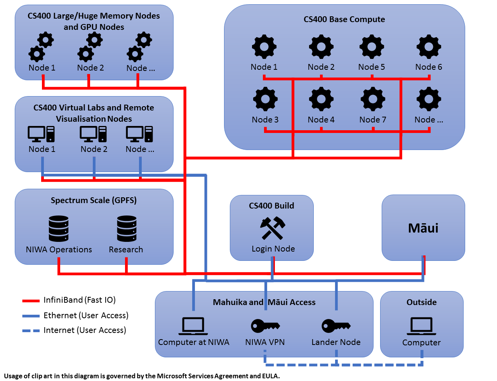
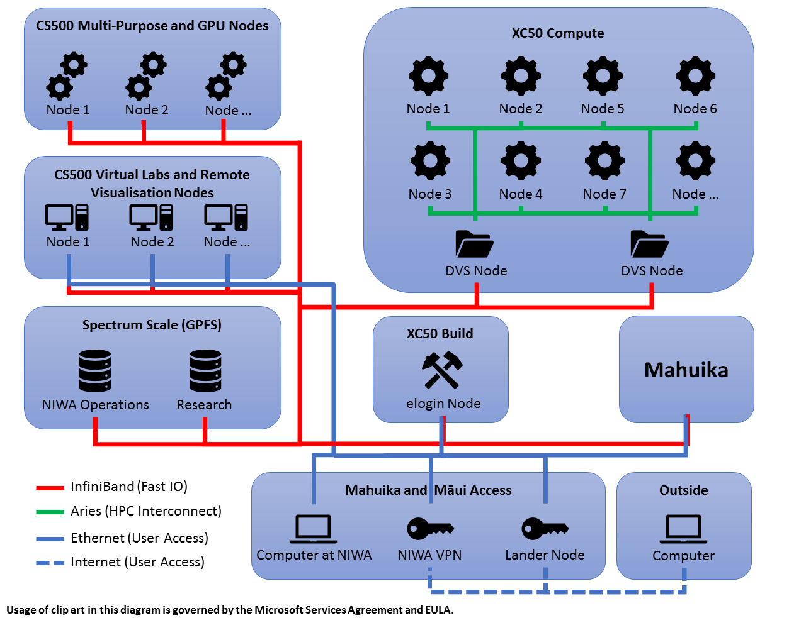

## Objectives

You will learn:

* about the differences between the two machines and what types of jobs are most suited to them
* about the different types of nodes available (multipurpose nodes, etc.)

## Overview

NeSI has acquired two new supercomputing platforms:

#### Mahuika (HPC1)
* Cray CS400
* [Capacity class](https://en.wikipedia.org/wiki/Supercomputer#Capability_versus_capacity) High Performance Computer
* Suitable for small workloads that use a single CPU core in a node, or multiple CPU cores across a small number of nodes for a given task
* Compute nodes can be shared with other jobs.
* Includes high memory, huge memory, and GPGPU nodes

#### Māui (HPC2)
* Cray XC50
* [Capability class](https://en.wikipedia.org/wiki/Supercomputer#Capability_versus_capacity) Supercomputer
* Suitable for large workloads that use many CPU cores on many nodes for a given task
* Compute nodes are allocated exclusively to a job
* Includes a number of Cray CS500 nodes that can be used for tasks that are IO-bound but need only a modest amount of CPU cores; these are typically pre- and post-processing tasks, such as data processing or visualisation
* Some CS500 nodes have GPGPUs

## System Architecture

Mahuika and Māui are colocated at NIWA's Greta Point campus in Wellington. They can both be accessed from the internet via the same lander nodes or NIWA's VPN service, please refer to section [Connecting](03-connecting.md) for details.

Both systems also share the same Spectrum Scale (formerly GPFS) file system - all files and directories can be accessed by all relevant nodes without any need for copying. However, note that CSx00 nodes and XC50 nodes run on different operating systems (CentOS and SLES, respectively). It is therefore generally **not** possible to use the same executables on both systems, so you will need to rebuild your codes. Rebuilding has the added benefit that you can ask the compiler to optimise your build for the different processors used on the system (Intel Xeon Broadwell in case of CS400 nodes, and Intel Xeon Skylake in case of CS500 and XC50 nodes). Please refer to sections [Building Code on Mahuika](09-building-code-on-mahuika.md) and [Building Code on Maui](10-building-code-on-maui.md) for details.

### Mahuika

### Māui

The above diagrams illustrate major building blocks and network connections on Mahuika and Māui relevant to users. Note that there are far more CS400, CS500, and XC50 nodes available than shown here. Note also that there is only one Spectrum Scale/GPFS storage system - it appears in either diagram to emphasise that storage is accessible from both systems.

Follow the blue network connections for user-accessible nodes. All Mahuika CS400 nodes and Māui CS500 nodes can access Spectrum Scale storage natively via InfiniBand for fast IO (red lines). Cray Aries interconnect (green lines) is used for low-latency communication between XC50 compute nodes on Māui, and for Spectrum Scale access via DVS (Data Virtualization Service) nodes.

#### Mahuika Compute Hardware:
##### 234 CS400 compute nodes
* 2x Intel Xeon E5-2600 v4 Broadwell 2.1 GHz processors with 18 physical cores each (36 physical cores per node)
* 128 GB of RAM per node

##### 16 CS400 large memory nodes
* Same Intel Xeon E5-2600 v4 processor as compute nodes
* 512 GB of RAM per node
* 4 nodes with 2x Nvidia Tesla P100 GPGPUs
* Some nodes are virtualised (several virtual machines share resources on each node)

##### 1 CS400 huge memory node
* Same Intel Xeon E5-2600 v4 processor as compute nodes
* 4 TB of RAM per node

#### Māui Compute Hardware:
##### 464 XC50 compute nodes
* 2x Intel Xeon Gold 6148 2.4 GHz processor with 20 physical cores each (40 physical cores per node)
* 50% of nodes with 96 GB, 50% with 192 GB of RAM per node

##### 28 CS500 nodes
* Same Intel Xeon Gold 6148 SKL processor as compute nodes
* 768 GB of RAM per node
* 8 nodes with 1x Nvidia Tesla P100 GPGPU
* Some nodes are virtualised (several virtual machines share resources on each node)

#### More hardware details:
##### CS400/CS500 nodes
* 2-way hyperthreading with a total of 72 (CS400)/80 (CS500) logical cores per node
* Native access to Spectrum Scale filesystems (ideal for IO-intensive jobs)
* Non-interactive nodes for running batch jobs, e.g., preprocessing or postprocessing of HPC jobs
* Virtual lab nodes for interactive work with remote desktop capability
* Run a full version of CentOS 7

##### XC50 compute nodes
* 2-way hyperthreading with a total of 80 logical cores per node
* Cray Aries interconnect (low-latency network, used by MPI jobs, IO, ...)
* DVS (Data Virtualization Service) links for accessing Spectrum Scale filesystems over Cray Aries (currently no native access possible), which may limit IO performance for some jobs
* Used only for running jobs, no direct access
* Run a slim version of SLES (SUSE Linux Enterprise Server)

##### XC50 eLogin nodes
* Same Intel Xeon Gold 6148 SKL processor as compute nodes (no cross-compilation needed!)
* Native access to Spectrum Scale filesystems
* Used for building codes, submitting jobs, ...
* Run on a full version of SLES

#### Storage
* Dedicated cluster for the Shared Service nodes
* InfiniBand network for access from build nodes and CSx00 nodes to ensure high throughput and low latency
* Cray DVS provides access to Spectrum Scale from compute nodes via the Aries interconnect

#### Main improvements
* Faster processors compared to those on FitzRoy or Pan
* GPGPU (General Purpose Graphical Processing Unit) nodes to support science codes and visualisation; the Nvidia Tesla P100 GPGPUs are much more powerful compared to Pan
* A Linux user environment that will make it easier to manage work, develop and run research workloads/jobs, and apply data analytics tools (compared to FitzRoy)
* Increased storage capacity and hierarchical storage management to minimise the need to move data between the HPC storage and a user's home institution, and underpin the new interactive data analysis services
* Vastly increased file system performance, reducing the time spent reading and writing data to the filesystems
* More advanced feature sets (such as AVX-2 on Broadwell processors, and AVX-512 on Skylake processors) which provide more opportunities to develop faster codes
